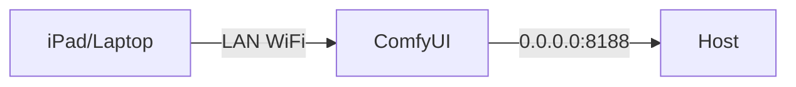

# Deployment Recipe 2: LAN (Restricted)

This recipe allows access from other devices on your local network (e.g., an iPad on WiFi) but **NOT** from the internet.

> [!WARNING]
> This configuration exposes ComfyUI to **everyone** on your WiFi/LAN.
> Do NOT use this on public WiFi (cafes, airports) or untrusted networks.

## Architecture



## Configuration

### 1. Bind Address

You must tell ComfyUI to listen on all interfaces.

**Command:**

```bash
python main.py --listen 0.0.0.0
```

### 2. OpenClaw Security (Mandatory)

Since any device on the LAN can access the API, you MUST secure sensitive actions.
Set these Environment Variables:

```ini
# Require a token for admin actions (Stop/Approve)
OPENCLAW_ADMIN_TOKEN=your-strong-secret-token

# Explicitly allow admin write actions from non-loopback LAN clients
OPENCLAW_ALLOW_REMOTE_ADMIN=1

# Require a token for Logs/Config viewing
OPENCLAW_OBSERVABILITY_TOKEN=observability-secret

# Keep strict localhost no-origin behavior (do not relax on LAN)
OPENCLAW_LOCALHOST_ALLOW_NO_ORIGIN=0

# Optional startup log hygiene (avoid stale historical error lines in UI)
OPENCLAW_LOG_TRUNCATE_ON_START=1
```

### 3. Firewall Rules (Host)

Ensure your host firewall blocks inbound traffic from the Internet (WAN) but allows LAN.

**Windows (PowerShell):**

```powershell
New-NetFirewallRule -DisplayName "ComfyUI LAN" -Direction Inbound -LocalPort 8188 -Protocol TCP -Action Allow -RemoteAddress LocalSubnet
```

*Note: `-RemoteAddress LocalSubnet` restricts access to your local network segment.*

**Linux (ufw):**

```bash
sudo ufw allow from 192.168.1.0/24 to any port 8188
```

### 4. "Red Lines"

- ❌ Do not forward port 8188 on your router.
- ❌ Do not use `--listen 0.0.0.0` on a laptop connected to public WiFi.
- ❌ Do not set `OPENCLAW_LOCALHOST_ALLOW_NO_ORIGIN=true` on LAN/shared deployments.
- ❌ Do not assume LAN Remote Admin access also permits LAN-hosted custom LLM targets; `OPENCLAW_LLM_ALLOWED_HOSTS` alone does not allow private/reserved IP `base_url` values.

## Testing

1. Find your host IP (e.g., `192.168.1.10`).
2. From another device on WiFi, open the remote admin page: `http://192.168.1.10:8188/openclaw/admin`.
3. Enter `X-OpenClaw-Admin-Token` in the page and click **Save**.
4. Verify admin write actions (for example refresh runs, approval actions) are no longer denied by remote policy.
5. Open OpenClaw Settings in ComfyUI and try to view logs. It should challenge you for the `OPENCLAW_OBSERVABILITY_TOKEN` or deny access when missing.
