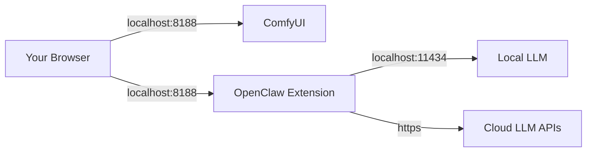

# Deployment Recipe 1: Local-only (Default)

This is the **safest and recommended** configuration for most users.
ComfyUI and OpenClaw run on your local machine, and no ports are exposed to the network.

## Architecture



## Configuration

### 1. Bind Address

Ensure ComfyUI is bound to `127.0.0.1` (loopback), not `0.0.0.0`.
This is the default for ComfyUI.

**Verification:**
Run ComfyUI and check the console output:

```text
Starting server
To see the GUI go to: http://127.0.0.1:8188
```

### 2. OpenClaw Settings

No special configuration is required.

- **Admin Token**: Not required for loopback-only operations (unless `OPENCLAW_ADMIN_TOKEN` is explicitly set).
- **Webhooks**: Disabled by default.
- **Local LLM (optional)**:
  - Ollama: `http://127.0.0.1:11434/v1`
  - LM Studio: `http://localhost:1234/v1`
  - Keep SSRF relax flags disabled:
    - `OPENCLAW_ALLOW_ANY_PUBLIC_LLM_HOST=0`
    - `OPENCLAW_ALLOW_INSECURE_BASE_URL=0`
- **No-origin convenience override (optional, local-only)**:
  - default/unset keeps strict no-origin denial
  - set `OPENCLAW_LOCALHOST_ALLOW_NO_ORIGIN=true` only when local CLI/tooling compatibility requires it
  - keep it unset/disabled for normal browser-only local use
- **Optional log hygiene**:
  - `OPENCLAW_LOG_TRUNCATE_ON_START=1` clears stale `openclaw.log` content once at startup.

### 3. "Red Lines" (What NOT to do)

- ❌ Do not run with `--listen 0.0.0.0` or `--listen`.
- ❌ Do not port-forward port 8188 on your router.
- ❌ Do not leave `OPENCLAW_LOCALHOST_ALLOW_NO_ORIGIN=true` enabled longer than needed.

## Testing

1. Open `http://127.0.0.1:8188` in your browser.
2. Open the OpenClaw tab in the sidebar.
3. Go to **Settings** -> **Health**.
4. If using Ollama, verify the daemon is reachable first via the native Ollama health/list surface `http://127.0.0.1:11434/api/tags`.
5. In **Settings -> LLM**, set provider to `Ollama (Local)`, leave **Base URL** empty to use the built-in `http://127.0.0.1:11434/v1` default (or set that exact loopback URL explicitly), and click **Load Models**.
6. All checks should be green.
